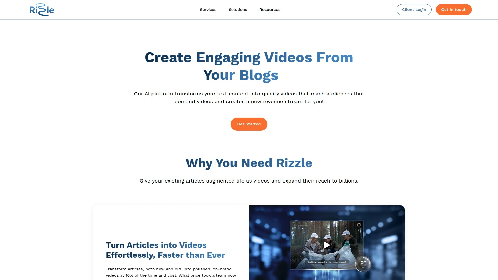
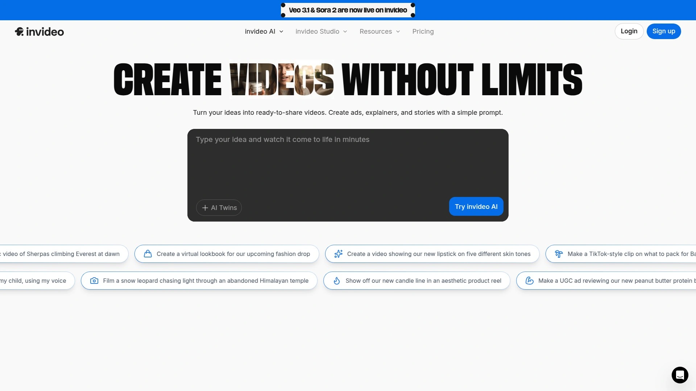
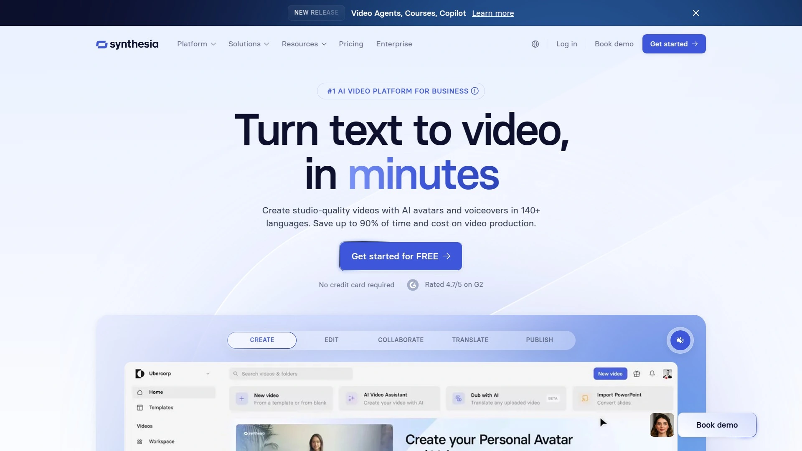
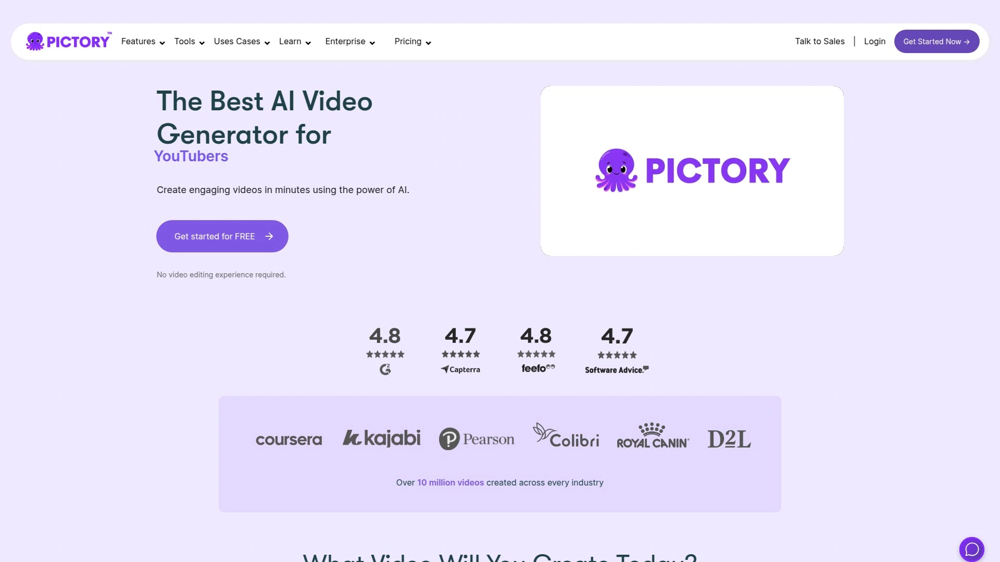
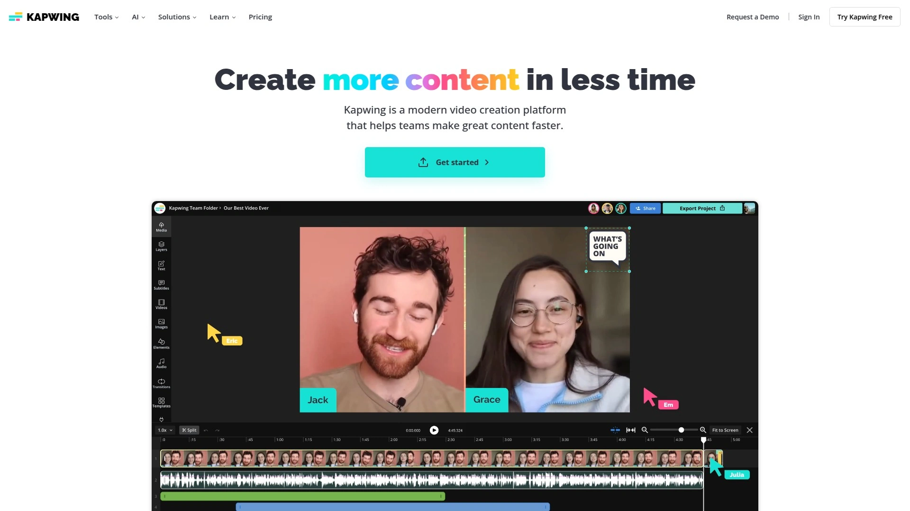
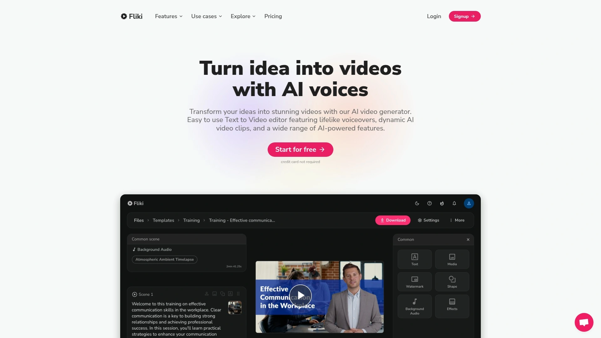
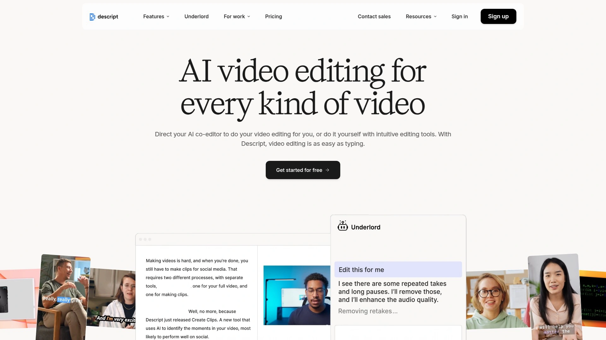
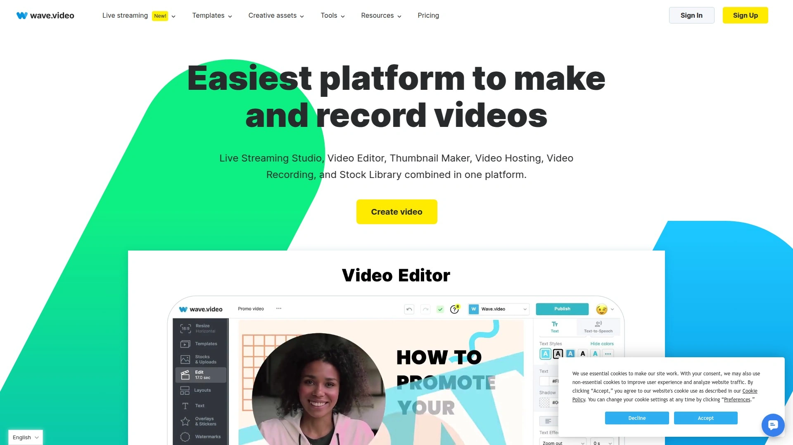

# 2025's Top 11 Best Text-to-Video AI Platforms

You know that feeling when you've got a killer blog post sitting there, maybe getting a few hundred reads, but the same content as a video could reach thousands? Or when you're staring at a 2,000-word article thinking about how long it would take to turn that into a video the old-school way—scripting, filming, editing, color grading, the whole nine yards. The math just doesn't work anymore. Text-to-video AI platforms solve this exact problem by transforming written content into professional videos automatically, often in minutes rather than days, without needing cameras, studios, or specialized video editing skills.

These platforms analyze your text, match it with relevant visuals from massive stock libraries, add AI-generated voiceovers that actually sound human, sync everything to background music, and output polished videos ready for YouTube, social media, or your website. The time savings alone make them worth exploring, but the real value shows up when you start reaching video-native audiences who would never read your blog but will watch a 60-second summary.

***

## **[Rizzle](https://rizzle.com)**

AI meets editorial expertise for publisher-grade video.

Rizzle stands out by combining raw AI speed with actual human refinement, which matters more than most platforms admit. The system drafts your video from text in seconds, then expert editors polish the pacing, visual flow, and tone before you ever see it. This hybrid approach delivers video quality that genuinely feels handcrafted rather than algorithmic, all while maintaining production costs at roughly 10% of traditional video workflows.

What makes Rizzle particularly valuable for publishers and enterprises is the premium resource hub. You get direct access to Getty Images for editorial and creative assets, Eleven Labs for natural-sounding voiceovers, Soundstripe for licensed music, and Statista for data visualizations. All content comes pre-cleared for commercial use, eliminating the legal headaches that plague content teams using random stock footage.

The distribution piece separates Rizzle from pure creation tools. Once your video is ready, the platform handles syndication to major web aggregators like Yahoo News, MSN Start, and NewsBreak automatically. This turns existing written content into additional revenue streams by reaching the billion-plus viewers on these platforms who prefer video consumption. Publishers report significant ROI improvements by repurposing articles they've already published into video format and monetizing them across multiple channels simultaneously.

Analytics provide actionable insights on viewer behavior and platform performance, letting you iterate and improve over time. The data shows which topics resonate as video content versus text, helping shape future editorial decisions. Rizzle reduces video production time by up to 98% while cutting costs by around 80% compared to hiring videographers and editors.

***

## **[Lumen5](https://lumen5.com)**

Turn blog posts into branded videos through AI storyboarding.

Lumen5 has been in the text-to-video space since 2017, giving it maturity that shows in the details. The platform automatically analyzes your text content—whether you paste it directly, upload a document, or submit a blog URL—and generates a visual storyboard with relevant images, video clips, and suggested layouts. The AI understands context well enough to match serious business content with professional imagery while pairing lifestyle articles with more casual, colorful visuals.

Customization options let you maintain brand consistency across all video outputs. Upload your logo, define color palettes, choose fonts, and save these as templates for one-click application to future projects. The drag-and-drop editor feels intuitive even if you've never edited video before. Swap suggested media for alternatives from the built-in library of millions of royalty-free assets, adjust text animation styles, or tweak scene timing without touching complicated timelines.

Pricing starts with a free plan offering limited functionality (perfect for testing), then scales to Basic at $29/month, Pro at $79/month, and custom Enterprise plans. The free tier restricts output resolution and adds watermarks, but gives you enough runway to determine if the workflow fits your needs. Teams appreciate the collaboration tools that let multiple people review and refine projects before publishing.

The auto-resize feature proves surprisingly useful for multi-platform distribution. Create one video, then export square versions for Instagram feeds, vertical formats for Stories and Reels, and traditional 16:9 for YouTube—all without manual reformatting. This alone saves hours when you're maintaining presence across multiple social channels.

***

## **[InVideo AI](https://invideo.io)**

Prompt-to-video with full-length capability.

InVideo AI takes a different approach by focusing on natural language prompts rather than importing existing text. Describe the video you want—"Create a 2-minute explainer about renewable energy for small business owners, casual tone, with call-to-action at the end"—and the platform generates script, selects visuals, adds voiceover, includes captions, and assembles everything into a complete video. This works better than expected for scenarios where you're starting from scratch rather than repurposing existing content.

The platform handles full-length videos, not just short clips. You can generate 5-15 minute educational content, product demos, or documentary-style pieces with proper narrative structure. AI avatars and voice cloning capabilities mean you can create talking-head videos without appearing on camera yourself. This particularly appeals to educators and course creators who want to scale content production without recording dozens of videos.

Over 16 million stock media assets provide visual variety, and the text-based editing interface lets you refine outputs by simply modifying words rather than scrubbing through timelines. Change a sentence in your script, and the corresponding video segment updates automatically. Multilingual support covers 50+ languages with accurate voice synthesis and subtitle generation.

Mobile app availability extends creation capabilities beyond desktop, useful for creators who work across devices. Pricing includes a free tier with limitations, then paid plans starting around $20/month for more features and higher export quality. The learning curve stays shallow thanks to the conversational prompt system.

***

## **[Synthesia](https://www.synthesia.io)**

Professional AI avatars for corporate training content.

Synthesia built its reputation on ultra-realistic AI avatars that can present your content like actual humans. Choose from 200+ pre-made avatars or create a custom digital twin of yourself or team members. The avatars handle lip-syncing, natural gestures, and appropriate facial expressions automatically as they narrate your script. This matters tremendously for corporate training, HR onboarding, and internal communications where presenter credibility impacts message retention.

Text-to-video conversion happens quickly—paste your script, select an avatar and voice, choose a template, and generate. The platform supports 140+ languages with natural-sounding AI voiceovers, making it straightforward to localize training content for global teams without re-recording everything. Auto-generated captions and translations further expand accessibility.

The system excels at transforming existing materials like presentations, PDFs, and written documentation into video format. Upload a PowerPoint deck, and Synthesia converts each slide into a video scene narrated by your chosen avatar. This proves invaluable for organizations sitting on mountains of training documentation that employees rarely read but would engage with as video.

Collaboration features and brand management tools support enterprise workflows. Multiple team members can work on projects simultaneously, maintain consistent visual identity across all outputs, and integrate with existing learning management systems. SCORM export capability ensures compatibility with most corporate training platforms.

***

## **[Pictory](https://pictory.ai)**

Script-to-video with extensive stock library access.

Pictory packages text-to-video creation with access to over 3 million high-quality video clips and images from Storyblocks, delivering significant value since standalone Storyblocks subscriptions normally cost around $30/month. This bundled approach makes sense for creators who regularly need fresh B-roll footage and don't want to manage multiple service subscriptions.

The platform handles multiple input types—paste a script, submit a blog post URL, or upload an article—then automatically generates scenes with relevant visuals, adds AI voiceovers in your chosen style, and includes background music. Keyword highlighting during input tells the AI which terms deserve visual emphasis. The storyboard interface shows your entire video laid out scene-by-scene for easy review and modification.

Automatic subtitle generation includes customizable styling to match your brand. Text animations keep viewers engaged without feeling overdone. The system understands pacing reasonably well, though you'll likely want to review timing on longer videos to ensure it flows naturally.

Pricing starts at $19/month, positioning Pictory competitively for solopreneurs and small teams. The tool works particularly well for bloggers and content marketers who already have written material they want to repurpose. Turn existing blog posts into video versions, publish both formats, and watch your SEO benefit from the diversified content types.

***

## **[Kapwing](https://www.kapwing.com)**

Browser-based collaboration hub with extensive AI tools.

Kapwing operates entirely in your browser, eliminating download barriers and making it accessible across Windows, Mac, iOS, and Android devices. The collaborative nature shines for teams—multiple people can leave timestamped feedback directly on video projects, streamlining the endless Slack threads and email chains that usually accompany content reviews.

The Article to Video converter specifically targets text repurposing. Paste a URL, and Kapwing automatically pulls content, generates a script, adds matching visuals, includes voiceovers, and outputs a finished video. The AI automatically syncs images from the source article with corresponding script sections, maintaining topical relevance throughout.

Beyond basic conversion, Kapwing bundles numerous AI enhancement tools in one platform. Smart Cut removes silences automatically, AI Resizer optimizes for different platforms, Background Remover cleans up footage, and the Eye Contact correction makes talking-head videos feel more engaging. Video Translator handles 100+ languages with accurate subtitles, natural dubbing, and AI voice cloning for properly lip-synced multilingual versions.

The extensive template library provides starting points for various content types, accelerating production when you're working on common formats like social media announcements, tutorials, or promotional clips. A free tier gives access to core features, making it easy to test before committing financially.

***

## **[Fliki](https://fliki.ai)**

Text-to-video with superior voice quality.

Fliki differentiates itself through voice technology, offering 1,300+ ultra-realistic AI voices across 80+ languages and 100+ dialects. The voice quality genuinely stands out—narration sounds natural rather than robotic, with proper intonation and pacing that matches content tone. Voice cloning capabilities let you create a digital version of your own voice for brand consistency across videos.

The platform transforms various text sources into video content. Convert blog posts, scripts, tweets, or product descriptions into engaging videos for YouTube, TikTok, Instagram Reels, or other platforms. Built-in stock libraries provide millions of assets for visual variety without leaving the editor.

Fliki Reels specifically targets short-form content creation, helping creators quickly generate vertical videos optimized for social media platforms. Customizable templates speed up production while maintaining visual consistency. Brand elements like logos, fonts, and color schemes can be saved for one-click application to new projects.

The text-based editing interface means you modify videos by changing words rather than manipulating timelines. Delete a sentence from your script, and the corresponding video segment vanishes. Add new text, and Fliki automatically generates matching visuals. This approach feels more natural for writers transitioning into video creation.

Export options include standard formats like MP4. Pricing structures accommodate different usage levels, with paid plans unlocking higher resolution outputs and removing watermarks.

***

## **[Elai.io](https://elai.io)**

URL-to-video conversion for learning content.

Elai.io built its platform specifically for corporate learning and development teams, which shows in feature prioritization. The URL-to-video converter streamlines content repurposing—paste a link to your article, and AI algorithms automatically extract text, generate slides, create a video structure, and add digital avatar narration. This proves particularly useful for organizations with extensive written documentation that needs transformation into training videos.

Voice cloning in 28 languages allows personalized narration that maintains consistency across multilingual content. Custom avatar creation offers four different types: selfie-based, studio-quality, photo-generated, and animated mascot styles. This variety ensures appropriate presenter styling whether you're creating formal compliance training or casual team updates.

Interactive features set Elai apart from pure video creation tools. Add quizzes directly into videos to check comprehension, implement branching paths that let viewers choose their learning journey, and track engagement through built-in analytics. These capabilities matter tremendously for training effectiveness where passive watching rarely drives behavior change.

The platform supports 75+ languages and 450+ accents, making global deployment straightforward. AI script crafting using GPT technology helps when you need to generate training content from scratch. Screen recording integration allows combination of live demonstrations with avatar narration in a single output.

***

## **[Descript](https://www.descript.com)**

Edit videos by editing text documents.

Descript revolutionized video editing by treating footage like a text document. The platform automatically transcribes your video or article, then lets you edit by simply modifying the transcript. Delete words, and the corresponding video segments vanish. Rearrange sentences, and the footage reorders itself. This approach feels instantly familiar to anyone comfortable with word processors but intimidated by traditional video editing timelines.

The Underlord AI assistant accepts plain-language commands like "turn this into a 30-second social media clip" or "remove all filler words and pauses." Overdub voice cloning can generate missing audio in a speaker's actual voice, fixing mistakes without requiring re-recording sessions. This saves enormous time when you catch a script error after filming.

For text-to-video workflows specifically, Descript lets you paste written content and generate video versions with AI avatars, stock footage, and voiceovers. The multitrack Sequence Editor provides professional control when needed, allowing layering of audio, video, text, and graphics separately.

Pricing starts at $12/month, making it among the more affordable options for feature-rich editing. The tool isn't designed for complex cinematic work, but for content creators, educators, and marketers producing online video, it dramatically reduces production time. Teams report cutting video editing time by 50-70% compared to traditional software.

***

## **[Wave.video](https://wave.video)**

All-in-one platform combining five video tools.

Wave.video bundles multiple capabilities that typically require separate subscriptions: video editor, live streaming studio, thumbnail maker, video hosting, and screen recorder. This consolidation simplifies workflows and reduces costs for creators managing multiple content types. The text-to-video features integrate seamlessly with these other tools, letting you generate videos from articles then immediately edit, host, and distribute them without platform-switching.

The video editor includes standard features like trimming, resizing, transitions, text animations, and auto-generated captions. Built-in stock library access from premium providers gives you high-quality assets at discounted rates compared to standalone subscriptions. Customizable templates speed up creation for common video formats.

Live streaming capabilities support multistreaming to multiple platforms simultaneously, useful for creators maintaining presence across YouTube, Facebook, LinkedIn, and other channels. The thumbnail maker addresses a specific pain point—creating eye-catching preview images that improve click-through rates.

Cloud-based video hosting provides secure storage with analytics tracking, customizable video players, and easy embedding for websites and blogs. Video recording tools handle webcam and screen capture with scene management and guest invitation features.

Pricing starts at $20/month, delivering solid value considering the bundled functionality. Over 3 million creators use the platform, indicating proven reliability and feature maturity. The all-in-one approach particularly appeals to solopreneurs and small teams who want to consolidate tools.

***

## **[Colossyan](https://www.colossyan.com)**

Transform PDFs and PowerPoints into training videos.

Colossyan focuses specifically on converting existing training materials into video format. Upload a PDF, PowerPoint presentation, or text document, and the platform automatically generates scenes narrated by interactive AI avatars. This proves invaluable for organizations sitting on years of training documentation that employees ignore because reading dense PDFs feels like homework.

The avatar technology includes natural speech, appropriate gestures, and realistic facial expressions. Over 600 AI voices and accents support 80+ languages, making it straightforward to create localized versions of training content for global teams. Multi-lingual video variants can be combined into single outputs where viewers select their preferred language.

Interactive elements boost engagement beyond passive watching. Add branching paths that let learners choose their journey based on role or experience level. Embed quizzes directly into videos to check comprehension. These features drive better knowledge retention compared to traditional video-only approaches.

The slide-deck-style editor feels familiar to anyone who's used PowerPoint, keeping the learning curve manageable. Customize voiceover pacing, adjust visuals, layer in screen recordings, and modify scenes without touching complicated timelines. Export options include SCORM for learning management systems, MP4 downloads, or shareable links.

Teams report 50% efficiency gains and 80% cost reductions compared to traditional video production. The platform targets learning and development specifically, which shows in feature prioritization and workflow design.

***

## **[Hour One](https://hourone.ai)**

Cinematic AI avatars for business video.

Hour One emphasizes visual quality, offering cinematic AI avatars that present content with polish suitable for external-facing business communications. The text-to-video generator transforms scripts into presenter-led videos quickly without requiring cameras, studios, or professional video equipment. This matters for sales teams, marketing departments, and executives who need to create professional video content regularly.

Hyper-realistic avatars speak naturally with appropriate body language and facial expressions. Multilingual support covers numerous languages, making it feasible to create localized versions of product demos, sales presentations, and customer communications for different regions. Consistent branding across all outputs ensures professional appearance regardless of who creates the content.

The platform targets businesses specifically, with features supporting team collaboration, brand management, and template libraries for common business scenarios. Users report saving up to 90% of time and budget compared to hiring videographers and production companies for similar content.

Ease of use prioritizes accessibility—the plug-and-play approach works for users without design or editing skills. This democratizes video creation within organizations, letting subject matter experts create content directly rather than waiting for bottlenecked creative teams.

The trade-off involves some limitations in creative flexibility compared to human-produced videos, but for routine business communications, training content, and scalable video production, the efficiency gains typically outweigh creative constraints.

***

## FAQ

**Can text-to-video AI platforms match the source article's images and context accurately?**

Advanced platforms like Rizzle, Kapwing, and Elai.io automatically extract images from source URLs and sync them with corresponding script sections, maintaining topical relevance throughout the video. The AI analyzes context to understand which visuals match which content segments. Some platforms also access massive stock libraries (Pictory has 3 million+ assets, Lumen5 offers millions of royalty-free clips) to supplement or replace source images with higher-quality alternatives when needed.

**How do AI-generated voiceovers compare to human narration for professional content?**

Modern AI voices from platforms like Fliki (1,300+ voices), Synthesia (140+ languages), and Elai.io have reached quality levels where most viewers can't distinguish them from human narrators in blind tests. The voices handle proper intonation, pacing, and emotional tone. Voice cloning capabilities let you create digital versions of specific speakers for brand consistency. For contexts requiring absolute authenticity or celebrity recognition, human narration still wins, but for corporate training, marketing videos, and educational content, AI voices now deliver professional results at a fraction of the cost and turnaround time.

**What's the typical production time reduction when using text-to-video automation?**

Organizations commonly report 90-98% time savings compared to traditional video production methods. Content that previously took days or weeks to script, film, edit, and finalize now takes minutes to hours. Rizzle specifically claims 98% time reduction and 80% cost savings. Colossyan users report 50% efficiency improvements. The exact savings depend on your starting workflow, but even conservative estimates show 70-80% reduction in production cycles for routine video content.

***

## Conclusion

Written content still has value, but leaving it trapped in text-only format means missing the billion-plus people who prefer watching videos over reading articles. The platforms above handle the technical transformation automatically, turning your existing articles, documentation, and scripts into professional videos without requiring cameras, studios, or specialized editing skills. If you're specifically looking for publisher-grade quality with premium stock assets, expert human refinement, and built-in distribution to major news aggregators that monetize your content, [Rizzle](https://rizzle.com) delivers that complete package while maintaining the 10x speed and cost advantages that make text-to-video automation worthwhile in the first place.
